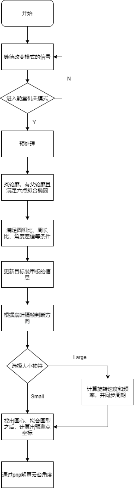

# Robomaster 2021 华广野狼团队步兵视觉

-----

## 1.功能介绍  

-----

- 装甲板视觉识别和能量机关视觉识别
- 自定义串口通讯协议与 stm32 进行通讯控制云台运动
- 自动击打能量机关的控制逻辑  

## 2.效果展示

-----

## 3.依赖工具与软硬件环境  

-----

### 软件运行环境：

- ubuntu 18.04

- OpenCV 4.1.0

- VSCode 1.53.0

- GCC 

### 硬件运行环境：

- NUC8i5BEK4

- MindVision MV-SUA134GC-T Industrial Camera

- USB 转 TTL 串口

## 4.编译与安装方式

-----

在 Ubuntu 下使用 VSCode 调用 GDB 来进行编译运行
注意：编译前记得校对``` .vscode ``` 文件夹中的 ``` task.json  ``` 文件所指的路径是否正确，包括相机驱动文 ``` libMVSDK.so ``` 件路径和可执行文件 ``` run.o  ``` 的路径是否正确

## 5.文件目录结构及文件用途说明

-----

```

RM_2021_VISION_CODE\
|   configure.h                             基础基成功能头文件
|   main.cpp                                
|   README.md
├─  armor                                   自瞄
|       rm_armorfitted.cpp
|       rm_armorfitted.h
|
├─  camera                                  相机类
|       └─param                             相机标定文件
|       rm_videocapture.cpp
|       rm_videocapture.h
|
├─  control                                 总控制文件
|       debug_control.h                     宏定义控制开关
|       rm_link.cpp                         链接类
|       rm_link.h
|
├─  data_exchange                           导出数据
|       └─fitting_data                      导出数据文件
|       data_exchange.cpp
|       data_exchange.h
|
├─  detect_buff                             能量机关
|       buff_detect.cpp
|       buff_detect.h
|
├─  filter                                  滤波器（kalman）
|       rm_kalmanfilter.cpp
|       rm_kalmanfilter.h
|
├─  fps                                     计算帧率
|       fps.cpp
|       fps.h
|
├─  pinhole                                 小孔成像
|       pinhole.cpp
|       pinhole.h
|
├─  serial                                  串口通讯
|       serialport.cpp       
|       serialport.h
|
└─  solve_PNP                               角度解算
        solve_pnp.cpp      
        solve_pnp.h

```

## 6.软件与硬件的系统框图与数据流图

-----


## 7.原理介绍与理论支持分析

-----

### 能量机关

<center>



</center>

a. <font color=red>图像二值化的操作</font>：通过 BGR 三通道中红蓝通道相见得到颜色部分的二值图，并与通过灰度值得到的二值图进行求交集从而获得神符的主体部分轮廓，该方法可以大部分滤除掉周围环境光带来的噪声。

b. <font color=red>找轮廓</font>：找出目标轮廓我们主要利用了 `findContours` 函数中的 `hierarchy` 。首先定义了一个容器 `vector<Vec4i> hierarchy` ，每个元素用以储存一个“用四个整形变量表示的轮廓之间的关系” 的向量。`hierarchy[i][0] ~ hierarchy[i][3]`,分别表示第i个轮廓的后一个轮廓，前一个轮廓，父轮廓，内嵌轮廓的索引编号。若当前轮廓没有对应的后一个轮廓、前一个轮廓、父轮廓、内嵌轮廓的话，则 `hierarchy[i][0]~hierarchy[i][3]` 的相应位被设置为默认值-1。当我们令外围为顶层，且若外围内的内围轮廓还包含了其他的轮廓信息，则内围内的所有轮廓均归属于顶层。利用这个关系，可以发现，我们的目标是装甲板那个小轮廓，可以把没有父轮廓（ `hierarchy[i][3]<0` ）的跳过。然后再基于已建立的父子轮廓的关系，我们可以根据他们的面积比和周长比进行一次粗略的筛选，并将找到的轮廓用旋转矩形标识出来，将其按照父子轮廓为一组放入 `Object` 类里面，命名父轮廓为 `big_rect_` ，子轮廓（待打击目标）为 `small_rect_`；

```C++

 if(hierarchy[i][3]<0 
 || contours[i].size() < 6 
 || contours[static_cast<uint>(hierarchy[i][3])].size() < 6)             
    continue;

if(small_rect_length < 10)             
    continue;

 if(small_rect_area < 200 || small_rect_area > 2000)
    continue;

if(big_rect_length < 50)
    continue;
 ```

之后我们将找到的轮廓用旋转矩形标识出来利用的是椭圆拟合矩形函数 `fitEllipse` 。原因是椭圆拟合出来的角度更加准确，且表示的角度范围在 0°~360° 之间，可以减少额外的转换运算。我们利用椭圆拟合矩形的角度，把筛选条件限定在装甲板和扇叶拟合出来的矩形的角度差值在80-110之间。

```C++

if(object.diff_angle<100 && object.diff_angle>80)  
 ```

c.<font color=red>确定旋转矩形四点顺序</font>：根据大小扇叶的比值关系来进行筛选得到可以用于判断扇叶状态的目标后，对旋转矩形的四个顶点进行排序处理：令半径较大的两个点分别为 0 和 1，令半径较小的两个点为 2 和 3，并以顺时针的方向依次排序，如图所示


最终的排序方式如上如圆圈中所示，这里的排序方法利用的是 `RotateRect` 类里面的特性，`RotateRect` 类所标识的矩形顶点编号如上图所示，y 值最大的为 0 点，其余按照顺时针一次编号，若出现两个相同的 y 值，则计 x 值最小的为 0 点。我们利用这样的特性，我们只要判断装甲板的两条长边的中心点跟 `big_rect_` 中心点的距离近，就可以顺利得到装甲板四点的正确的顺序。

d.<font color=red>判断旋转矩形状态</font>：通过两旁的灯杆。利用装甲板两条宽边向圆心方向延一段比例的距离，建立两个小块roi区域，计算roi区域的平均值，若roi区域均有值，则表明目标矩形是激活的（装甲板旁边有两个杆）否则未激活。

e.<font color=red>找出中心 R </font>：根据大扇叶的中点并往圆形衍生一定量的距离之后，用 ROI
进行框选，并对 ROI 范围内的目标进行筛选，最终稿得到中心 R，并根据中心 R 做出目标的轨迹圆。

f.<font color=red>隔帧判断扇叶旋转方向</font>：判断顺时针还是逆时针的方法是根据历史角度和当前角度的差值（要滤波）来判断.先去掉较大和较小的插值，在同自瞄的滤波思路一样 `d_angle_ = (1 - r) * d_angle_ + r * diff_angle_;`。

g.<font color=red>判断大小扇叶，计算预测量</font>：根据上位机发送的信号来对大小能量机关的选择计算预测量。由于小能量机关是匀速转动，所以可以在目标点的基础上加上一定的预测角度量即可，而打能量机关则是在小能量机关的基础上根据速度函数进行相应的增加或减少预测量。大能量的预测量先是通过卡尔曼滤波器对得到的角位移、角速度进行滤波处理，并根据得到的曲线得到相应的函数式子，但由于卡尔曼滤波器会有一定量的延迟性，进而对函数式进行相位纠正，并根据纠正后的函数式进行计算预测量，从而得到大能量机关所需的预测量。

h.<font color=red>预测点的坐标系转换</font>：将预测点的坐标系从极坐标系转换到笛卡尔坐标系之后，再将目标中点、目标矩形等发送给 PNP 解算模块进行解算云台偏转角度。

i.<font color=red>自动控制模块</font>：根据解算完的角度，自动控制模块会对根据过往的信息对云台发出相应的指令，其中有「开火、复位、跟随、不跟随」这四个模块，开火命令是在后台判断是否满足开火的条件，从而给予云台开火的命令；复位命令是防止云台在某些角度会丢失目标而执行的命令，命令会使云台在丢失目标的一定时间内使云台开始上下扫描，从而重新找回丢失的目标；跟随命令是在一般状态下一直执行，通常是与开火命令相互切换；不跟随命令是在目标丢失超过一定时间上限之后发出的命令，是在复位命令之后。通过自动控制模块之后，最终才将命令、目标角度等数据发送给串口。


## 8.软件架构

-----

## 9.未来优化方向

-----

